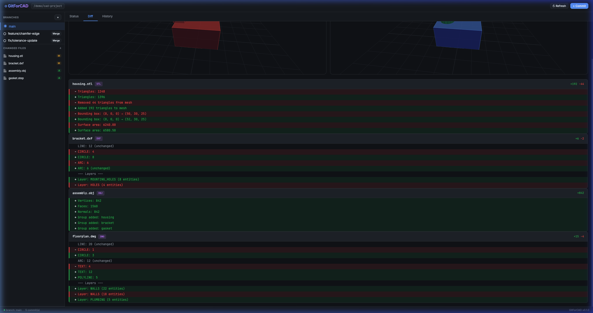

# ⚙ GitForCAD

**Version control system designed for CAD files** — with git-like CLI and a desktop GUI.

Supports DWG, STL, DXF, and OBJ files with intelligent geometry-aware diffing. Shows what changed in your 3D models and architectural floor plans with red (removed) and green (added) highlighting.



## Quick Start

### Build the CLI

```bash
cd /path/to/gitforcad
go build -o gitforcad .
```

This produces a single `gitforcad` binary. Add it to your PATH:

```bash
export PATH=$PWD:$PATH
```

### Basic Workflow

```bash
# Initialize a new repository
mkdir my-cad-project && cd my-cad-project
gitforcad init

# Add and commit files
gitforcad add model.stl drawing.dxf
gitforcad commit -m "Initial design"

# Create a branch and make changes
gitforcad branch feature-chamfer
gitforcad checkout feature-chamfer

# Edit your CAD files, then see what changed
gitforcad diff          # Red/green colored output

# Commit and merge back
gitforcad add .
gitforcad commit -m "Added chamfer to edge"
gitforcad checkout main
gitforcad merge feature-chamfer
```

### All Commands

| Command | Description |
|---------|-------------|
| `gitforcad init` | Initialize repository (default: `main` branch) |
| `gitforcad add <files>` | Stage files for commit |
| `gitforcad commit -m "msg"` | Commit staged changes |
| `gitforcad status` | Show working tree status |
| `gitforcad log [-n N]` | Show commit history |
| `gitforcad branch [name]` | List or create branches |
| `gitforcad branch -d name` | Delete a branch |
| `gitforcad checkout <branch>` | Switch branches |
| `gitforcad diff [file]` | Show changes with red/green coloring |
| `gitforcad merge <branch>` | Merge branch into current |

## Desktop GUI (Tauri)

### Prerequisites

- [Rust](https://rustup.rs/) (≥ 1.77)
- [Node.js](https://nodejs.org/) (≥ 18)

### Run in Development

```bash
cd gui
npm install
npx @tauri-apps/cli dev
```

### Build Distributable App

```bash
cd gui
npm install
npx @tauri-apps/cli build
```

This produces:
- **macOS**: `.dmg` installer
- **Windows**: `.msi` installer
- **Linux**: `.deb` / `.AppImage`

## CAD-Aware Diffing

GitForCAD understands CAD file formats:

| Format | What's Compared |
|--------|----------------|
| **STL** | Triangle count, bounding box, surface area, per-triangle changes |
| **DXF** | Entity types (LINE, ARC, CIRCLE...), layers, entity counts |
| **DWG** | Converted to DXF via LibreDWG; Entity types, layers, entity counts |
| **OBJ** | Vertex count, face count, normals, groups, materials |
| **Text** | Line-by-line unified diff |
| **Binary** | File size changes |

## Architecture

```
gitforcad/
├── main.go          # CLI entry point
├── cmd/             # Cobra CLI commands
├── core/            # VCS engine (objects, staging, refs, merge)
├── diff/            # CAD-aware diff engine (STL, DXF, OBJ)
└── gui/             # Tauri desktop app (React + Three.js)
```

### Storage Model

Like Git, GitForCAD uses content-addressable storage:

- **Blobs**: File content compressed with zlib, addressed by SHA-256
- **Trees**: Directory listings mapping names to blob/tree hashes
- **Commits**: Tree hash + parent(s) + author + timestamp + message
- **Objects stored at**: `.gitforcad/objects/<hash[:2]>/<hash[2:]>`

## License

MIT
